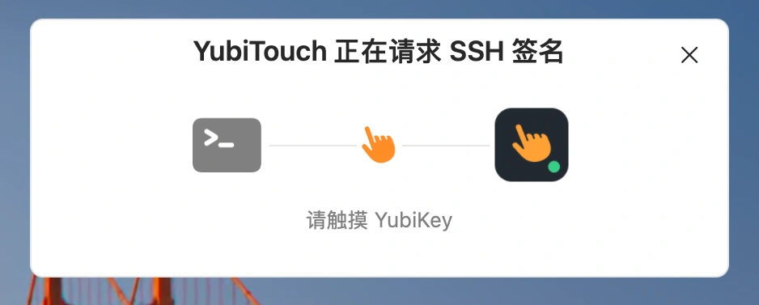
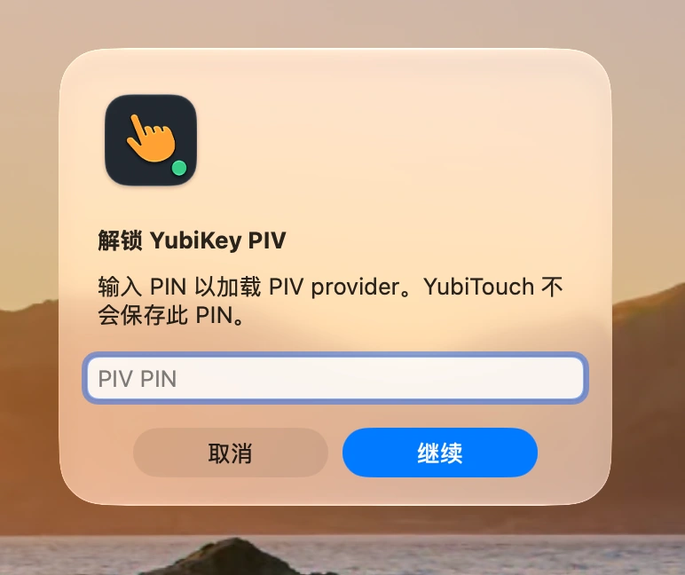
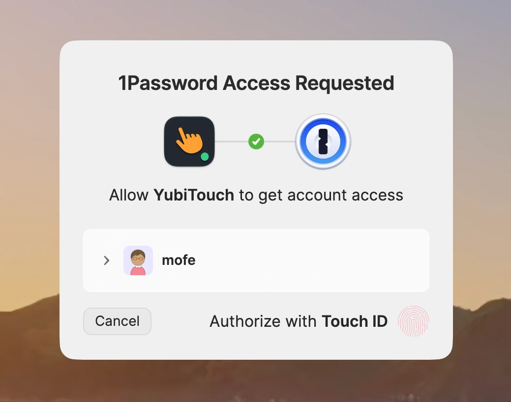

# YubiTouch

YubiTouch 是一个面向 macOS、YubiKey PIV、YKCS11、OpenSSH 和 age 的本地密钥操作
服务。它在真正发生 PIV 签名或 age X25519 解密时显示原生触摸提示，并在操作返回后自动关闭。
公共入口 `~/.ssh/yubitouch/agent.sock` 保持不变；可选的缺卡回退可以在
YubiKey PIV Agent 与 1Password SSH Agent 之间原子切换该入口。
独立入口 `age-plugin-yubitouch` 则让 age 使用已有的 PIV X25519 主密钥，并可选择一把
保存在 1Password 中、与硬件密钥相互独立的 X25519 恢复密钥。

YubiTouch 是独立开源项目，与 Yubico 没有关联，也未获得 Yubico 的认可或背书。

> 当前状态：v0.1 源码构建版。Agent 路由/PIV 代理、LaunchAgent、OpenSSH backend、AskPass、
> 1Password Go SDK、原生 UI 和主要真实环境兼容性验证已经完成。项目只支持用户从可信
> 源码在本机完成构建与安装，不计划提供预编译应用、Developer ID 签名/公证或 Homebrew 包。

age 用户可以直接阅读：

- [使用 YubiTouch 保护 age 文件](docs/age-tutorial.md)：从 hardware-only 到可选 1Password
  recovery 的完整操作教程；
- [YubiTouch age 功能参考](docs/age-reference.md)：路径选择、session 复用、协议、安全边界、
  状态分类和密钥轮换；
- [真实环境验证矩阵](docs/verification.md#age-插件21)：arm64 硬件和 1Password 验收记录。

<p align="center">
  
</p>
<p align="center"><sub>真实签名请求会显示请求方、YubiTouch 和当前触摸状态。</sub></p>

## 安装与首次使用

项目不提供预编译安装包。请只从你信任的源码 checkout 在本机构建。下面是从一把未配置
的 YubiKey 到首次 SSH 登录的完整步骤。

### 1. 安装依赖

要求 macOS 13 或更高版本、YubiKey 5.7 或更高固件、Go 1.25 或更高版本，以及 Xcode
Command Line Tools。PIV 的 ED25519 支持从 YubiKey 5.7 开始，OpenSSH 的 ED25519
PKCS#11 支持从 10.1 开始。这里安装的 Homebrew OpenSSH 是 YubiTouch 后端
`ssh-agent`、`ssh-add` 和 `ssh-keygen -D` 的依赖，不要求把日常使用的 SSH 客户端换成
Homebrew 版本。

```sh
xcode-select -p
brew install age go openssh yubico-piv-tool ykman

ykman --version
"$(brew --prefix openssh)/bin/ssh" -V
```

如果 `xcode-select -p` 失败，先运行 `xcode-select --install` 并完成 Apple 的安装界面。

普通连接可以继续使用 macOS 自带的 `/usr/bin/ssh`，无需调整 `PATH` 中 `ssh` 的优先级；
Apple OpenSSH 10.3p1 已完成真实签名登录验证。YubiTouch 会根据配置直接定位 Homebrew
后端工具。以后 Apple 更新系统 OpenSSH 时，仍建议先运行 `yubitouch test-sign` 和一次真实
SSH 登录再确认兼容性。

1Password 模式还需要 1Password 桌面应用。在 **Settings > Developer** 中启用
**Integrate with other apps**，并按需启用 Touch ID。YubiTouch 使用 1Password Go SDK，
不需要 `op` CLI。

### 2. 配置 YubiKey PIV 9A

这一节会修改 YubiKey。开始前必须有备用登录方式，例如第二把 key、云主机控制台或另一
个管理员账号。不要猜 PIN；错误 PIN 会消耗设备的有限重试次数。

先检查固件、PIV 状态和 9A 槽位：

```sh
ykman info
ykman piv info
ykman piv keys info 9a
```

如果 9A 已有重要密钥，立即停止，不要执行下面的生成或导入命令。`ykman piv reset` 会
清空整个 PIV 应用中的密钥和证书，YubiTouch 的安装不需要运行它。

全新的 PIV 应先修改默认 PIN、PUK 和 Management Key。下面的命令会交互式读取旧值和
新值，不要把这些值写进命令行参数：

```sh
ykman piv access change-pin
ykman piv access change-puk
ykman piv access change-management-key \
  --algorithm AES192 \
  --generate \
  --protect \
  --touch
```

把新 PIN 和 PUK 分开保存在可靠的密码管理器或离线恢复记录中。受 PIN 保护的随机
Management Key 留在 YubiKey 内，`--touch` 使后续 PIV 管理操作也需要触摸。

推荐直接在 YubiKey 内生成新的 ED25519 私钥。私钥从不离开设备：

```sh
mkdir -p "$HOME/.ssh"
chmod 700 "$HOME/.ssh"

piv_public_key="$HOME/.ssh/yubikey-piv-9a.pem"

ykman piv keys generate \
  --algorithm ED25519 \
  --pin-policy ONCE \
  --touch-policy ALWAYS \
  9a "$piv_public_key"

ykman piv certificates generate \
  --subject "CN=SSH PIV Authentication" \
  --valid-days 3650 \
  9a "$piv_public_key"

ykman piv keys info 9a
```

最终元数据必须显示 `Algorithm: ED25519`、`PIN required for use: ONCE` 和
`Touch required for use: ALWAYS`。PIN 策略只在生成或导入时设置；如果 Touch 显示为
`NEVER`，不能原地修改，必须在确认恢复路径后重新写入 9A。

如果必须保持现有 SSH 公钥，可以把现有 ED25519 私钥以加密 PKCS#8 形式导入 9A：

```sh
ykman piv keys import \
  --pin-policy ONCE \
  --touch-policy ALWAYS \
  9a /path/to/encrypted-ed25519-pkcs8.pem

ykman piv certificates import \
  9a /path/to/ssh-piv-certificate.pem
```

私钥转换、证书创建、指纹核对和迁移文件清理可参考
[macOS 使用 YubiKey PIV + YKCS11 保护现有 SSH 密钥](https://gist.github.com/mofelee/e4ececb2f1512b4c5bb588a45a08d1bc)
的第 5 至 9 节。`ykman` 5.9.2 的 ED25519 `--verify` 存在已知缺口，导入证书时不要添加
该参数。导入方案中的原始私钥副本仍可绕过 YubiKey；只有确认备用和恢复路径后才能处理
这些副本。Gist 后续的自建 Agent、`Match exec` 和通知脚本已由 YubiTouch 取代，不要安装。

通过项目实际使用的 YKCS11 provider 导出 SSH 公钥：

```sh
provider="$(brew --prefix yubico-piv-tool)/lib/libykcs11.dylib"
ssh_keygen="$(brew --prefix openssh)/bin/ssh-keygen"

"$ssh_keygen" -D "$provider"
"$ssh_keygen" -D "$provider" |
  awk '$1 == "ssh-ed25519"' > "$HOME/.ssh/yubikey-piv.pub"

test "$(wc -l < "$HOME/.ssh/yubikey-piv.pub")" -eq 1
chmod 600 "$HOME/.ssh/yubikey-piv.pub"
"$ssh_keygen" -lf "$HOME/.ssh/yubikey-piv.pub"
```

YKCS11 通常还会列出 RSA PIV Attestation key；它不是 SSH 登录 key，不要删除 F9
Attestation 槽位。如果行数检查失败，说明存在多个或没有 ED25519 key，请删除错误的
`yubikey-piv.pub` 并人工选择注释为 `PIV Authentication` 的 9A 公钥。

使用已有且可信的登录方式，把 `~/.ssh/yubikey-piv.pub` 加入每台目标服务器对应账户的
`~/.ssh/authorized_keys`。服务器只需要公钥，不要复制私钥。导入原有 SSH 私钥且指纹完全
一致时，服务器已有的公钥无需修改。

### 3. 构建并安装 YubiTouch

```sh
git clone https://github.com/mofelee/yubitouch.git
cd yubitouch

make test
make vet
make app

ditto dist/YubiTouch.app /Applications/YubiTouch.app
mkdir -p "$HOME/.local/bin"
ln -sfn /Applications/YubiTouch.app/Contents/MacOS/yubitouch \
  "$HOME/.local/bin/yubitouch"
ln -sfn /Applications/YubiTouch.app/Contents/MacOS/age-plugin-yubitouch \
  "$HOME/.local/bin/age-plugin-yubitouch"
export PATH="$HOME/.local/bin:$PATH"
yubitouch version
command -v age-plugin-yubitouch
```

应用必须先放到稳定位置，再注册 LaunchAgent。注册后移动或删除应用会使登录启动路径失效。
把 `export PATH="$HOME/.local/bin:$PATH"` 保留在 `~/.zprofile` 后，重启终端也可以直接运行
`yubitouch` 和精确命名的 `age-plugin-yubitouch`，无需设置临时 `$YT` 变量。age 按插件名
从 `PATH` 查找独立可执行文件；只链接 `yubitouch` 不能启用 age 集成。

`yubitouch version` 中的十六进制值是构建时的 Git commit，不是每次 `make app` 都会变化的
构建序号。同一个 commit 重新构建仍会显示同一个值；可以用 `git rev-parse --short=12 HEAD`
核对。该命令只验证磁盘上的 CLI，不能证明已经运行的 LaunchAgent daemon 已经重启。
首次安装请继续完成下一步的 `configure` 和 `ensure`；覆盖已有安装时请使用下文“从源码
更新”的停服、复制和重新启动顺序。

### 4. 配置 PIN 来源并启动服务

YubiTouch 只把非敏感配置保存到 `~/.ssh/yubitouch/config.json`。不要设置
`YUBITOUCH_PIN`；PIN 不会保存在配置、环境变量、命令行或日志中。

选择一种 PIN 来源并保存配置，只执行下面两组命令中的一组。

使用系统安全输入框：

```sh
YUBITOUCH_PIN_PROVIDER=prompt \
YUBITOUCH_PUBLIC_KEY="$HOME/.ssh/yubikey-piv.pub" \
yubitouch configure
```

<p align="center">
  
</p>
<p align="center"><sub>系统安全输入框模式：PIN 只用于加载 PIV provider，不会保存。</sub></p>

使用 1Password Desktop App Integration：

```sh
YUBITOUCH_PIN_PROVIDER=1password \
YUBITOUCH_1PASSWORD_ACCOUNT='My Account' \
YUBITOUCH_1PASSWORD_REF='op://Personal/YubiKey PIV/pin' \
YUBITOUCH_PUBLIC_KEY="$HOME/.ssh/yubikey-piv.pub" \
yubitouch configure
```

使用 1Password 时，先创建保存 PIV PIN 的字段，并复制该字段的 `op://` secret
reference。`YUBITOUCH_1PASSWORD_ACCOUNT` 可以是 1Password 显示的账户名或账户 UUID；
配置文件保存 reference，不保存其指向的 PIN。

<p align="center">
  
</p>
<p align="center"><sub>1Password 模式：由桌面应用授权读取 PIN，不显示系统 PIN 输入框。</sub></p>

#### 可选：YubiKey 未插入时使用 1Password SSH Agent

缺卡回退默认关闭，并且与上面的 PIN 来源是两个独立功能。`pin_provider=1password`
是在 YubiKey 存在时从 1Password 读取 PIV PIN；`fallback_agent=1password`
是在 YubiKey 明确不存在时，让 OpenSSH 直接使用 1Password SSH Agent 中的
同一把私钥。只有两处公钥指纹完全一致时才能启用。

在 1Password 的 **Settings > Developer** 中启用 SSH Agent，然后使用
`~/.config/1Password/ssh/agent.toml` 把 Agent 可见身份限制为这一把 key。例如：

```toml
[[ssh-keys]]
vault = "Private"
item = "YubiKey SSH Key"
```

`vault` 和 `item` 应改为保存原始私钥的实际 vault 和 SSH Key item。该文件的
有效规则不能再暴露其他 key；直接路由不经过 YubiTouch 的 Agent 协议过滤，
因此这是安全前提，而不是可选整理。先检查 1Password Agent 只列出一把 key，
且指纹与 `~/.ssh/yubikey-piv.pub` 一致：

```sh
onepassword_agent="$HOME/Library/Group Containers/2BUA8C4S2C.com.1password/t/agent.sock"

SSH_AUTH_SOCK="$onepassword_agent" \
  "$(brew --prefix openssh)/bin/ssh-add" -L |
  "$(brew --prefix openssh)/bin/ssh-keygen" -lf -

"$(brew --prefix openssh)/bin/ssh-keygen" -lf \
  "$HOME/.ssh/yubikey-piv.pub"
```

第一条命令必须只输出一行指纹，并且与第二条一致。启用回退并重载：

```sh
YUBITOUCH_FALLBACK_AGENT=1password yubitouch configure
yubitouch reload
yubitouch doctor
```

默认使用 1Password 的 macOS Agent socket。只在 1Password 使用非标准路径时，才在
`configure` 命令上同时设置 `YUBITOUCH_FALLBACK_AGENT_SOCKET=/absolute/path/to/agent.sock`。
要关闭回退，运行：

```sh
YUBITOUCH_FALLBACK_AGENT=none yubitouch configure
yubitouch reload
```

上述环境变量只在执行 `configure` 时使用。配置保存后，登录启动的 daemon 直接读取配置
文件，不依赖 shell 环境变量。随后注册当前 GUI 用户的 LaunchAgent 并验收：

```sh
yubitouch ensure
yubitouch doctor
yubitouch status
yubitouch test-sign
```

`ensure` 创建 `~/Library/LaunchAgents/com.github.mofelee.yubitouch.plist`。重新登录后服务会
自动恢复公共 Agent 路由，但不会提前读取 PIN、签名或加载 YKCS11。启用缺卡回退时，daemon
会对 1Password Agent 执行无签名副作用的 identity readiness 查询；该查询不应显示 Touch ID。
只有 PIV 路由上的 `test-sign` 或 SSH 真实签名请求才会加载 provider。

`test-sign` 成功时会输出：

```text
Test signature succeeded. Signature data was not retained.
```

### 5. 配置并使用 SSH

在 `~/.ssh/config` 中让目标主机使用公共 Agent socket 和 PIV 公钥：

```sshconfig
Host example-yubikey
    HostName server.example.com
    User your-user
    IdentityAgent ~/.ssh/yubitouch/agent.sock
    IdentityFile ~/.ssh/yubikey-piv.pub
    IdentitiesOnly yes
    ForwardAgent no
    ControlMaster auto
    ControlPersist 10m
    ControlPath ~/.ssh/yubitouch-%C.sock
```

之后直接运行 `ssh example-yubikey`。YubiKey 存在时，首次建立连接会请求 PIN 或
1Password PIN 授权，并显示 YubiKey 触摸提示；回退路由上则只显示 1Password 的授权界面。
复用已有 `ControlMaster` 连接时不会产生新签名，因此没有 UI。
即使启用缺卡回退，`IdentityFile` 也必须是配置的那一把 PIV 公钥，并且必须保留
`IdentitiesOnly yes`；这会让 OpenSSH 只请求服务器已接受的目标身份。

下面的 `ssh` 可以是 macOS 自带的 `/usr/bin/ssh`，也可以是 Homebrew OpenSSH；只有
YubiTouch 管理的后端固定使用 Homebrew OpenSSH。

检查 OpenSSH 最终采用的配置并连接：

```sh
ssh -G example-yubikey |
  awk '$1 ~ /^(identityagent|identityfile|identitiesonly|forwardagent|controlmaster|controlpath|controlpersist)$/ {print}'

ssh example-yubikey
```

需要强制进行一次新签名时，先关闭复用的 master：

```sh
ssh -O exit example-yubikey
ssh example-yubikey
```

跳板和目标都接受同一 PIV key 时可以直接使用 ProxyJump：

```sshconfig
Host bastion
    HostName bastion.example.com
    User your-user

Host internal-target
    HostName target.internal
    User your-user
    ProxyJump bastion

Host bastion internal-target
    IdentityAgent ~/.ssh/yubitouch/agent.sock
    IdentityFile ~/.ssh/yubikey-piv.pub
    IdentitiesOnly yes
    ForwardAgent no
    ControlMaster auto
    ControlPersist 10m
    ControlPath ~/.ssh/yubitouch-%C.sock
```

运行 `ssh internal-target` 时，OpenSSH 会从本机分别认证跳板和目标，不需要 Agent
Forwarding，因此默认应保持 `ForwardAgent no`。

确实需要从某台远程主机再发起 SSH 时，可以只对完全可信的 Host 设置
`ForwardAgent yes`。这会让远程主机在连接存活期间请求当前路由上的 Agent 签名；私钥
不会被复制，但受控的远程主机仍可以利用该能力。回退到 1Password 时，可转发的就是
`agent.toml` 暴露的身份，这也是 YubiTouch 要求其中只有目标 key 的原因。路由切换只影响
新建 Agent 连接；已建立连接继续使用建立当时的路由。

#### 使用 YubiKey 签署 GitHub Commit

GitHub 的 SSH 登录认证和 Commit 签名是两种独立用途。打开
[SSH and GPG keys](https://github.com/settings/keys)，把 `~/.ssh/yubikey-piv.pub` 的完整
内容添加为 `Signing Key`。如果同一把 key 已经用于 GitHub SSH 登录，仍需再添加一次并将
类型选择为 `Signing Key`。Commit 使用的邮箱也必须是 GitHub 账户中已验证的邮箱。

Git 的 `gpg.ssh.program` 需要调用标准 `ssh-keygen`，而签名进程还必须连接 YubiTouch
Agent socket。为了不替换终端、IDE 或其他程序的默认 `SSH_AUTH_SOCK`，先创建一个只供
Git 签名使用的本地 wrapper。`yubitouch-ssh-sign` 不是项目自带命令；下面的命令会生成它，
并在生成时记录当前 Mac 上 Homebrew OpenSSH 的稳定路径：

```sh
ssh_keygen="$(brew --prefix openssh)/bin/ssh-keygen"
mkdir -p "$HOME/.local/bin"

cat > "$HOME/.local/bin/yubitouch-ssh-sign" <<EOF
#!/bin/sh
export SSH_AUTH_SOCK="\$HOME/.ssh/yubitouch/agent.sock"
exec "$ssh_keygen" "\$@"
EOF

chmod 700 "$HOME/.local/bin/yubitouch-ssh-sign"
```

然后配置当前用户的 Git。`user.signingkey` 使用公钥文件路径；私钥仍留在 YubiKey 中：

```sh
git config --global user.signingkey "$HOME/.ssh/yubikey-piv.pub"
git config --global gpg.format ssh
git config --global gpg.ssh.program "$HOME/.local/bin/yubitouch-ssh-sign"
git config --global commit.gpgsign true
git config --global tag.gpgSign true
```

如果原配置使用 1Password 的 `op-ssh-sign`，第三条命令会只把 Git Commit/Tag 的签名程序
切换到 YubiTouch wrapper，不会改变 SSH Host 的 `IdentityAgent` 配置。检查最终配置：

```sh
git config --global --get-regexp \
  '^(user.signingkey|gpg.format|gpg.ssh.program|commit.gpgsign|tag.gpgsign)$'
```

之后正常运行 `git commit` 或 `git tag -s` 即可。wrapper 始终连接稳定的
`agent.sock`，不需要因路由切换而修改 Git 配置。YubiKey 存在时使用 PIV 并显示
YubiTouch 触摸提醒；回退到 1Password 时由 1Password 显示 Touch ID/授权界面，不显示
YubiTouch 触摸浮层。推送到 GitHub 后，正确关联的签名会显示 `Verified`。

### 6. 配置并使用 age

第一次配置建议按 [age 使用教程](docs/age-tutorial.md) 顺序执行；路径选择、密文兼容性、
session 生命周期和安全限制集中记录在 [age 功能参考](docs/age-reference.md)。本节保留安装流程
所需的内联摘要。

age 功能只读取和使用用户已经配置好的 PIV X25519 key，不生成、导入、覆盖、删除或同步
YubiKey 密钥。MVP 只有一个 profile：一把由十进制 serial、PIV slot 和 `x25519` 明确定位的
硬件主密钥，以及最多一把可选的 1Password 恢复密钥。硬件 key 与 SSH 使用的 9A
ED25519 key 是两个独立槽位和用途；不要把 SSH 私钥当作 age ECDH key。

配置硬件主路径时，把占位值替换为本机读取的目标设备信息，不要把完整 serial 贴到 Issue、
日志或终端共享记录中：

```sh
YUBITOUCH_AGE_SERIAL='<decimal-serial>' \
YUBITOUCH_AGE_SLOT='82' \
YUBITOUCH_AGE_ALGORITHM='x25519' \
yubitouch configure
```

如需 recovery，先在 1Password 中保存一把与硬件 key 独立的、原生 age X25519 identity
（`AGE-SECRET-KEY-1...`），并在本地取得其公开 `age1...` recipient。YubiTouch 不生成或同步
这对密钥。随后一次性合并以下公开配置；这里复用顶层 `onepassword_account`：

```sh
YUBITOUCH_1PASSWORD_ACCOUNT='<account name or UUID>' \
YUBITOUCH_AGE_RECOVERY_PROVIDER='1password' \
YUBITOUCH_AGE_RECOVERY_IDENTITY_REF='op://<vault>/<item>/<field>' \
YUBITOUCH_AGE_RECOVERY_RECIPIENT='age1...' \
yubitouch configure
```

age 配置只接受以下六个环境变量，并且只在显式运行 `yubitouch configure` 时按“当前环境变量
优先于已有配置，已有配置优先于内置默认值”合并并持久化：

- `YUBITOUCH_AGE_SERIAL`
- `YUBITOUCH_AGE_SLOT`
- `YUBITOUCH_AGE_ALGORITHM`
- `YUBITOUCH_AGE_RECOVERY_PROVIDER`
- `YUBITOUCH_AGE_RECOVERY_IDENTITY_REF`
- `YUBITOUCH_AGE_RECOVERY_RECIPIENT`

daemon 不接受每次解密的临时覆盖。恢复私钥本身不得进入配置、命令行或普通环境变量；
`YUBITOUCH_AGE_RECOVERY_IDENTITY`、`YUBITOUCH_AGE_RECOVERY_PRIVATE_KEY` 和
`YUBITOUCH_AGE_RECOVERY_SECRET` 只要非空就会被 `configure` 明确拒绝。

首次输出 recipient 或 identity 时，如果配置中还没有硬件公钥缓存，必须插入目标 YubiKey。
这次操作只读取并校验槽位公钥，将 32 字节公开值缓存到配置；不会请求 PIN、执行 ECDH 或
显示触摸提示。读取在一次性只读 helper 中完成；超时或取消会终止整个 helper 进程组并等待
回收；父 CLI/daemon 异常退出也会通过生命周期管道立即清理 helper 及其子进程，阻塞的同步
PKCS#11 调用不会成为孤儿。缓存写入会在锁内重新读取最新配置，只合并
`age.public_key`；并发 `configure` 修改 recovery 或其他设置不会被旧配置覆盖，读取期间硬件
目标变化则本次命令不缓存也不输出。两个命令成功时 stdout 都严格只有一行，诊断只写 stderr：

```sh
yubitouch age recipient > recipient.txt
yubitouch age identity > identity.txt
test "$(wc -l < recipient.txt)" -eq 1
test "$(wc -l < identity.txt)" -eq 1
chmod 600 identity.txt

# 让已经运行的 daemon 读取新配置和刚缓存的硬件公钥。
yubitouch reload
```

`recipient.txt` 是公开、可复制的 `age1yubitouch1...` 组合 recipient；`identity.txt` 是不含
私钥、serial、slot、PIN 或 1Password reference 的本机
`AGE-PLUGIN-YUBITOUCH-1...` 描述符。插件必须以精确名称 `age-plugin-yubitouch` 出现在
`PATH`。用 age v1.3.1 加密和解密：

```sh
age -R recipient.txt -o secret.txt.age secret.txt
age -d -i identity.txt -o secret.txt secret.txt.age
```

保存 recipient 后，加密只使用其中的公开材料，不连接 daemon、YubiKey 或 1Password；即使
设备已拔出、daemon 已停止仍可加密。解密统一连接私有 `~/.ssh/yubitouch/age.sock`。目标
YubiKey 已连接时只走硬件 stanza，并与 SSH 签名共享同一条全局 PIV 队列。daemon 管理一个
隔离的常驻 hardware helper，由它持有 YKCS11 module、已登录 session 和目标 private object，
daemon 本体不持有 PKCS#11 session。

第一次硬件解密会启动独立的一次性 PIN resolver。resolver 取得 PIN 后通过有界私有 pipe 交给
hardware helper，关闭输出并退出；hardware helper 必须先等待并回收 resolver，才执行
`C_Login`，随后立即清零可变 PIN 缓冲区。因此常驻 helper 只保留 YubiKey 的已认证 session，
不保留可再次读取的 PIN 值。成功请求不会销毁该 session；同一 session 内的后续解密不再调用
PIN provider，但仍会重新校验 session/key，并且每次都必须经过独立的
`ready_for_touch -> UI -> continue -> CKM_ECDH1_DERIVE` 回合。每次 ECDH 创建的派生对象仍在
该次操作结束前独立销毁。

在 PIN 输入或 1Password 授权尚未结束时不显示 YubiTouch 触摸提示。只有 resolver 已退出并
回收、YKCS11 login 和 session/key 验证成功，daemon 才显示“age 解密”触摸提示并允许 helper
继续执行 ECDH。只有两次有界且成功的目标探测都明确返回 `not_detected`，中间经过短暂去抖，
才会启动一次 recovery helper；recovery helper 每次请求后退出，不复用 recovery identity。

插入其他 YubiKey、serial/slot/算法/公钥不匹配、探测失败或状态不明、PIN 错误、PIN provider
失败或取消、触摸取消或超时，以及 YKCS11/ECDH/KDF/AEAD 失败都直接失败，不访问 recovery；
PIN 错误和 PIN provider 失败/取消也不会显示触摸提示。
一旦同一请求选择并开始硬件路径，就绝不会切换到 recovery。1Password 授权失败/取消、恢复
identity 解析失败或与配置 recipient 不匹配同样只失败一次，不尝试其他 key。

常驻 hardware helper/session 在以下任一条件出现时销毁并完成进程回收；下一次硬件解密重新
启动一次性 PIN resolver 并登录：

- IOKit 报告任何 YubiKey 插入或移除事件，包括设备总数未变化的替换；
- 配置 reload，包括目标 serial、slot、algorithm 或 public key 改变；
- daemon 停止、重载、崩溃或重启，hardware helper 自身退出或重启；
- PKCS#11 token、session 或 private object 失效，hardware helper 内的硬件/ECDH/解包或严格帧协议返回错误，或前一次结果状态无法确认；
- 当前请求被客户端或触摸 UI 取消、断开或超时；
- helper 的父进程身份、代码身份或生命周期验证失败，或设备事件流异常关闭。

已经进入常驻 helper 的 hardware 请求只有正常解密成功才保留 session；首版没有额外的空闲或
绝对 TTL。设备重插或旧 session 在私钥操作前已明确失效时，下一次请求可以建立新 session；
ECDH 已开始或结果状态不明时绝不自动重试。

在 macOS+cgo 构建中，hardware/recovery 私钥 helper 会在读取配置前及执行敏感操作前验证
直接父进程：父子必须属于同一用户，具有相同的完整可执行路径和代码身份，并都启用 Hardened
Runtime；未加固、被动态库注入、经 shell 或其他可执行文件直接启动都会失败关闭。其他平台或
未启用 cgo 的构建不提供这项认证，因此私钥 helper 一律拒绝运行。应使用 `make app` 或
`make build` 生成经过本地 runtime 签名的源码构建产物，直接 `go build` 的二进制不能运行私钥
helper。daemon 通过专用生命周期管道持有常驻 hardware helper 和每个一次性 recovery helper；
daemon 崩溃或被强制终止时，helper 会立即终止自己的整个进程组，不会脱离原生命周期继续
持有 SDK secret 或硬件 session。

> 启用 recovery 会降低整份密文的整体安全级别：硬件 key 和恢复 key 是任一方都能独立
> 解密的 OR 关系，安全性取两条路径中较弱的一条。1Password SDK 以不可变 Go `string`
> 返回 secret，无法可靠原地清零；YubiTouch 的主要隔离边界是禁用 core dump、尽力锁定和
> 清零可变缓冲区、只返回 16 字节 file key，并让一次性 helper 在每次请求后立即退出。
> 这不具备 YubiKey 私钥不可导出的硬件安全属性。

### 7. 日常维护、更新和卸载

常用命令：

```text
yubitouch status          查看脱敏状态
yubitouch doctor          检查依赖、权限、设备和 SSH 配置
yubitouch test-sign       独立测试 PIN、触摸和签名链路
yubitouch age recipient   输出公开 age recipient
yubitouch age identity    输出本机 age 插件 identity
yubitouch reload          重启服务并读取配置
yubitouch stop            停止当前用户的 LaunchAgent
```

从源码更新：

```sh
cd /path/to/yubitouch
git pull --ff-only
make test
make vet
make app

# 必须先停止仍在运行的旧 daemon，再覆盖磁盘上的 App。
yubitouch stop
ditto dist/YubiTouch.app /Applications/YubiTouch.app

# 这两行应显示相同的 commit；相同 commit 重建时哈希不会改变。
git rev-parse --short=12 HEAD
yubitouch version

# 持久化新 schema 的默认值，再从刚复制的 App 启动 daemon。
yubitouch configure
yubitouch ensure
yubitouch doctor
```

不要只运行 `make app`、`ditto` 和 `yubitouch version`：`version` 会启动一个短暂的 CLI
进程读取新二进制，但原有 daemon 仍可能继续运行旧代码。上述
`stop -> ditto -> configure -> ensure` 顺序会明确替换后台进程并持久化新 schema；
更新非敏感配置但没有
替换 App 时，使用 `yubitouch reload` 即可。

从旧的单 socket 版本升级时，这一次 `configure` 会补全内部
`~/.ssh/yubitouch/piv-agent.sock` 路径。新 daemon 会把旧的 `agent.sock` 替换为受管符号链接；
不要在服务运行时手工删除或重建该路径。如果同时要启用缺卡回退，把上面的
`yubitouch configure` 替换为 `YUBITOUCH_FALLBACK_AGENT=1password yubitouch configure`。

卸载应用和登录服务：

```sh
yubitouch stop
rm -f "$HOME/Library/LaunchAgents/com.github.mofelee.yubitouch.plist"
rm -f "$HOME/.local/bin/yubitouch"
rm -f "$HOME/.local/bin/age-plugin-yubitouch"
rm -rf /Applications/YubiTouch.app
```

最后从 `~/.ssh/config` 删除对应 Host 配置。确认不再需要配置和诊断日志后，可以自行删除
`~/.ssh/yubitouch`。PIV 私钥始终留在 YubiKey 中，不会随应用卸载而删除。

## 工作方式

```text
ssh / DebianForm
       |
       v
~/.ssh/yubitouch/agent.sock  (managed symlink)
       |
       +--> piv-agent.sock --> YubiTouch PIV Agent --> OpenSSH ssh-agent
       |                                            --> YKCS11 / PIV 9A / touch
       |
       `--> 1Password agent.sock --> 1Password SSH Agent
```

LaunchAgent 登录后启动轻量 daemon 和内部 PIV Agent。YubiKey 存在或缺卡回退未启用
时，公共路径指向 `piv-agent.sock`。PIV 路由上的密钥列表查询只返回配置的
PIV 9A 公钥，不启动 backend、不读取 PIN，也不显示 UI。只有目标公钥的真实
`SignRequest` 才加载 YKCS11 provider。

启用回退后，daemon 通过 IOKit 的 USB 插拔通知维护 YubiKey 存在状态。移除事件会立即
失败闭合到 PIV；只有防抖时间结束后仍明确为 `not_detected`，且 1Password socket 安全、
可达、包含目标 key 并且没有其他 key 时，才把公共路径切到 1Password。IOKit 错误、
回退检查失败、daemon 启停过程都失败闭合到 PIV，不会在状态不明时暴露 1Password Agent。
YubiKey 重新出现后会由插入事件直接切回 PIV。该监视器只读取 USB registry，不打开
PC/SC/CCID，也不读取或记录设备序列号。

在任何 1Password 路由生效前，daemon 都会先原子写入 `0600` 的
`~/.ssh/yubitouch/route-guard.json`。下次启动会在解析主配置之前读取该 guard 并撤掉上次
记录的 fallback，因此主配置损坏、fallback socket 改名或异常退出后也不会无人监管地保留
1Password 直连。guard 只保存受管 socket 路径，不保存 key、PIN 或签名数据。

路由切换通过临时符号链接加原子 `rename` 完成，不在两个 Agent 之间转发或改写协议帧。
新连接跟随新路由；切换前已经打开的 Unix socket 连接保持连接到原 Agent。因此
OpenSSH `session-bind@openssh.com` 和内核提供的直接对端身份不会被一层回退 proxy 吞掉：
PIV 路由继续使用 YubiTouch 已有的 session-bind 重放，1Password 路由则由客户端直接交付。

1Password 路由上的签名完全绕过 YubiTouch PIV Agent。因此授权和 Touch ID 界面由
1Password 拥有，不显示 YubiTouch 触摸浮层，`last_sign_event`/`last_sign_at` 也不会记录
这次签名。这是直接路由保留协议和对端语义的结果。

PIV 路由的触摸等待浮层提供取消按钮。按钮绑定到该次请求的内部 ID，
只取消当前显示的请求；取消会
关闭该客户端的 backend 连接、立即关闭浮层且不自动重试，不会取消其他排队或后续请求。
标准 SSH Agent 协议只返回通用失败；`test-sign` 会从脱敏 state 分类为 canceled 并返回 6。

PIV 路由上每次真实签名的浮层会显示发起程序，例如 Terminal、iTerm2、DebianForm、IDE 或
YubiTouch 自己的 `test-sign`，并保留直接 Agent 客户端（通常为 `ssh`）。macOS daemon 在
接受 Unix socket 连接时通过内核 `LOCAL_PEERPID` 捕获直接客户端，再以固定深度追溯父进程；
进程启动时间在路径解析前后必须一致，避免退出进程或 PID 复用把身份串到另一请求。

应用名称优先取自可执行文件所属且代码签名有效的 app bundle；无 bundle、未签名或解析失败
时稳定降级为可执行文件名或“未知程序”，身份解析失败不会阻断签名。程序身份只作为触摸前
的辅助判断，不是对已经控制当前用户会话的恶意软件的身份认证。

age 使用独立的数据流，不经过 SSH Agent 路由：

```text
age -> age-plugin-yubitouch -> ~/.ssh/yubitouch/age.sock -> daemon
                                                        +-> one-shot public/probe helper
                                                        |      `-> YKCS11 public read
                                                        +-> persistent hardware helper
                                                        |      +-> one-shot PIN resolver
                                                        |      `-> reusable YKCS11 session / PIV X25519 ECDH
                                                        `-> one-shot recovery helper / 1Password
```

私有 socket 使用 4 字节长度前缀的有界 v1 JSON frame，每个连接只处理一个请求，并校验
macOS 内核报告的对端 EUID。帧大小、连接数和处理时间均有上限；客户端断开会取消对应请求。
IPC 只接受完整、规范化的 profile/stanza，失败响应只能使用预定义分类，不传递底层错误文本。
daemon 的设备 probe 与 CLI 首次公钥读取还分别通过有界私有 pipe 启动只读 helper；serial、slot
和目标公钥不进入 argv、普通环境变量或日志。helper 不继承 PIN、AskPass、Agent 或 age debug
环境，且接口没有登录或私钥操作。同步 PKCS#11 即使永久阻塞，父进程也会在超时、取消或客户端
断开时关闭 pipe、杀死整个独立进程组并完成唯一一次 `wait`，下一次请求不会复用该 child。

## age 插件协议

完整的组件、状态机、协议字段、密钥生命周期和错误分类见
[YubiTouch age 功能参考](docs/age-reference.md)。下面保留 v1 密码学格式摘要，供审阅源码和
兼容性实现时使用。

`age1yubitouch1...` recipient 的 v1 二进制 payload 固定为：版本、`x25519` 算法号、recovery
flag、零保留字节、16 字节 profile ID、16 字节硬件 key ID 和 32 字节规范化硬件公钥；启用
recovery 时再追加 16 字节 recovery key ID 和 32 字节规范化恢复公钥。
`AGE-PLUGIN-YUBITOUCH-1...` identity payload 只包含版本、算法号、两个零保留字节、profile ID
和硬件 key ID，不包含公钥、设备或恢复配置定位信息。profile ID 只绑定硬件公钥；hardware/recovery
key ID 分别使用独立 domain，通过 `SHA-256(domain || NUL || public-key)` 的前 16 字节得到。

每个 age file key 固定为 16 字节。recipient 为每条路径生成独立的临时 X25519 key，并写出：

```text
-> yubitouch v1 hardware|recovery <profile-id> <key-id>
<32-byte ephemeral public key || 32-byte authenticated ciphertext>
```

X25519 shared secret 经 HKDF-SHA256 派生 32 字节 wrapping key。salt 是
`SHA-256("age-plugin-yubitouch/v1/x25519-salt" || NUL || ephemeral-public-key || recipient-public-key)`，
info 是 `age-plugin-yubitouch/v1/x25519-wrap`。16 字节 file key 使用 ChaCha20-Poly1305 和全零
nonce 封装；每个 wrap 都有独立临时 key 和派生 wrapping key。关联数据以
`age-plugin-yubitouch/v1/stanza-ad` 开始，并绑定版本、算法、路径、profile ID、key ID、临时
公钥和目标公钥。hardware 与 recovery stanza 包装同一个 file key，文件正文仍只加密一次。

解析器拒绝未知版本、算法、flag、路径或非零保留位，错误长度、非规范编码、零值或不匹配 ID，
非规范/低阶 X25519 公钥，相同的硬件与恢复公钥，重复 hardware/recovery stanza、缺失 hardware
stanza、复用 hardware key ID 的 recovery stanza，以及 AEAD 认证失败。设备连接时只校验并
使用 hardware stanza，因此启用、禁用或轮换 recovery 前生成的密文仍可走硬件路径；设备明确
缺失时才要求密文 recovery stanza 的 ID 与当前配置完全匹配，否则失败且不尝试其他 key。
格式不解析或兼容 `age-plugin-yubikey`。

插件使用 age 官方插件 API，协议和插件自动化测试的当前目标版本是 age v1.3.1。仓库中的
固定向量用于锁定 recipient、identity、两种 stanza 和跨路径解包行为。不要在真实文件上设置
`AGEDEBUG=plugin`：这是 age 上游调试开关，其输出可能包含插件协议内容和 file key；YubiTouch
无法替上游过滤或清理这类调试输出。

## 依赖

```sh
brew install age openssh yubico-piv-tool ykman
```

1Password 模式还需要安装 1Password 桌面应用，并在 **Settings > Developer** 中启用
**Integrate with other apps**。按需在安全设置中启用 Touch ID。YubiTouch 使用官方
Go SDK，不依赖 `op` CLI。

构建需要 Go 1.25 或更高版本、Xcode Command Line Tools 和 CGO。

## 构建

```sh
make test
make test-race
make vet
make app
```

应用输出到 `dist/YubiTouch.app`。开发安装时应先把应用移动到稳定位置，再建立 CLI
入口并注册 LaunchAgent；移动已经注册的二进制会使 launchd 路径失效。

```sh
ditto dist/YubiTouch.app /Applications/YubiTouch.app
mkdir -p ~/.local/bin
ln -sfn /Applications/YubiTouch.app/Contents/MacOS/yubitouch ~/.local/bin/yubitouch
ln -sfn /Applications/YubiTouch.app/Contents/MacOS/age-plugin-yubitouch ~/.local/bin/age-plugin-yubitouch
```

`make app` 只生成当前 Mac 原生架构的本地应用，并以 ad-hoc 签名启用 Hardened Runtime，
使私钥 helper 可以拒绝未加固或被动态库注入的父进程。该签名不是 Developer ID 签名；项目
不分发该产物，也不把它标记为已公证或 universal。其他用户应在自己的目标 Mac 上从源码
运行测试并构建。主程序只保留加载用户所配置 YKCS11 provider 所需的 library-validation 例外；
不允许 DYLD 环境注入或调试授权。

## 配置

YubiTouch 将非敏感配置保存到 `~/.ssh/yubitouch/config.json`，文件权限为 `0600`，
目录权限为 `0700`。配置 schema 没有 PIN 字段；设置 `YUBITOUCH_PIN` 会被明确拒绝。

### 准备 PIV 9A 公钥

先确认 9A 槽位算法与触摸策略，再通过项目实际使用的 YKCS11 provider 枚举公钥：

```sh
ykman piv keys info 9a
mkdir -p ~/.ssh
chmod 700 ~/.ssh
"$(brew --prefix openssh)/bin/ssh-keygen" -D "$(brew --prefix yubico-piv-tool)/lib/libykcs11.dylib"
"$(brew --prefix openssh)/bin/ssh-keygen" -D "$(brew --prefix yubico-piv-tool)/lib/libykcs11.dylib" | awk '$1 == "ssh-ed25519"' > ~/.ssh/yubikey-piv.pub
test "$(wc -l < ~/.ssh/yubikey-piv.pub)" -eq 1
chmod 600 ~/.ssh/yubikey-piv.pub
```

YubiTouch v0.1 要求该文件是 `ssh-ed25519` PIV 9A 公钥。不要使用 YKCS11 返回的 RSA
PIV Attestation key。第一条 `ssh-keygen -D` 命令应显示 9A 的 `PIV Authentication` 注释；
如果设备还有其他 ED25519 PIV key，停止并人工选择 9A 对应行，不要使用自动过滤结果。
`configure` 会拒绝其他算法或多行文件，`doctor` 会确认配置公钥出现在 provider 输出中并
报告被过滤的其他 key 数量。

### 手动 PIN

```sh
export YUBITOUCH_PIN_PROVIDER=prompt
export YUBITOUCH_PUBLIC_KEY="$HOME/.ssh/yubikey-piv.pub"
yubitouch configure
yubitouch ensure
yubitouch test-sign
```

第一次真实签名时显示 `NSSecureTextField` 对话框。图形会话不可用时尝试从当前 TTY
安全读取；两者都不可用时快速失败。

### 1Password

```sh
export YUBITOUCH_PIN_PROVIDER=1password
export YUBITOUCH_1PASSWORD_ACCOUNT='My Account'
export YUBITOUCH_1PASSWORD_REF='op://Personal/YubiKey PIV/pin'
export YUBITOUCH_PUBLIC_KEY="$HOME/.ssh/yubikey-piv.pub"
yubitouch configure
yubitouch ensure
yubitouch test-sign
```

这一节配置的是 PIV PIN 来源，不会自动启用缺卡 SSH Agent 回退。回退的
`agent.toml` 身份隔离要求和启用命令见上文“可选：YubiKey 未插入时使用
1Password SSH Agent”。两个功能可以独立或同时使用。

`YUBITOUCH_1PASSWORD_ACCOUNT` 可以是桌面应用显示的账户名或账户 UUID。v0.1 只支持
Desktop App Integration，不使用 service account token。SDK 返回不可变 Go `string`，
因此无法形式化保证原地清零；YubiTouch 把解析限制在一次性 AskPass helper 进程中，
写入 OpenSSH AskPass 管道后立即退出。受 Go 垃圾回收、运行库复制和外部 SDK/OpenSSH
行为影响，任何模式都无法形式化证明内存中不存在残留副本。

在 1Password 模式下，`yubitouch doctor` 会本地校验 secret reference 语法，并初始化
Desktop App Integration client 来验证账户和桌面集成；这可能触发 1Password 自己的授权
界面，但不会解析或读取 PIN，也不会加载 YKCS11。只有显式 `yubitouch test-sign` 才会通过
一次性 AskPass helper 调用 `Secrets().Resolve`，验证引用存在性和完整授权链路。

1Password Go SDK v0.4.0 的 macOS Desktop App Integration backend 不响应调用方的
`context.Context` 取消（上游 [#266](https://github.com/1Password/onepassword-sdk-go/issues/266)）。
YubiTouch 超时时会终止自己启动的 `ssh-add`、一次性 AskPass 或 age recovery helper，并返回
对应的失败分类；但 1Password 应用拥有的授权窗口可能继续显示，需要用户在 1Password 中
手动取消。YubiTouch 不会通过辅助功能或 UI 自动化操作 1Password 窗口；升级 SDK 前必须
重新验证该上游限制。

其他支持的覆盖变量：

- `YUBITOUCH_CONFIG`
- `YUBITOUCH_YKCS11`
- `YUBITOUCH_OPENSSH_PREFIX`
- `YUBITOUCH_SOCKET`
- `YUBITOUCH_PIV_SOCKET`
- `YUBITOUCH_BACKEND_SOCKET`
- `YUBITOUCH_FALLBACK_AGENT`
- `YUBITOUCH_FALLBACK_AGENT_SOCKET`
- `YUBITOUCH_SOUND`
- `YUBITOUCH_SIGN_TIMEOUT`
- `YUBITOUCH_LOG_LEVEL`

修改环境变量后再次运行 `yubitouch configure`，然后运行 `yubitouch reload`。

`configure` 时的优先级为：当前环境变量、已有配置文件、内置默认值。除内部 daemon 的
`--config` 外，v0.1 没有配置字段的命令行覆盖。daemon 不读取交互式 shell 环境；它只读取
`ensure` 注册时确定的 `0600` 配置文件。`YUBITOUCH_CONFIG` 只选择配置文件位置，不写入文件。

| 配置字段 | 环境变量 | 默认值 |
|---|---|---|
| `pin_provider` | `YUBITOUCH_PIN_PROVIDER` | `prompt` |
| `onepassword_account` | `YUBITOUCH_1PASSWORD_ACCOUNT` | 1Password 模式必填 |
| `onepassword_ref` | `YUBITOUCH_1PASSWORD_REF` | 1Password 模式必填 `op://` reference |
| `public_key` | `YUBITOUCH_PUBLIC_KEY` | 必填 |
| `ykcs11` | `YUBITOUCH_YKCS11` | Homebrew `opt/yubico-piv-tool` 自动检测 |
| `openssh_prefix` | `YUBITOUCH_OPENSSH_PREFIX` | Homebrew `opt/openssh` 自动检测 |
| `socket` | `YUBITOUCH_SOCKET` | `~/.ssh/yubitouch/agent.sock` |
| `piv_socket` | `YUBITOUCH_PIV_SOCKET` | `~/.ssh/yubitouch/piv-agent.sock` |
| `backend_socket` | `YUBITOUCH_BACKEND_SOCKET` | `~/.ssh/yubitouch/backend.sock` |
| `fallback_agent` | `YUBITOUCH_FALLBACK_AGENT` | 关闭；可设为 `1password` |
| `fallback_agent_socket` | `YUBITOUCH_FALLBACK_AGENT_SOCKET` | 启用时使用 1Password macOS Agent socket |
| `sound` | `YUBITOUCH_SOUND` | `Glass`；`none` 静音 |
| `sign_timeout` | `YUBITOUCH_SIGN_TIMEOUT` | `60s`；必须大于零且不超过 `1h` |
| `log_level` | `YUBITOUCH_LOG_LEVEL` | `info` |

可选 `age` 段严格校验嵌套字段，不接受未知字段：

| 配置字段 | 环境变量 | 约束 |
|---|---|---|
| `age.serial` | `YUBITOUCH_AGE_SERIAL` | 规范的非零十进制 uint32 |
| `age.slot` | `YUBITOUCH_AGE_SLOT` | PIV `9a`/`9c`/`9d`/`9e` 或退休槽 `82` 到 `95` |
| `age.algorithm` | `YUBITOUCH_AGE_ALGORITHM` | 仅 `x25519` |
| `age.recovery.provider` | `YUBITOUCH_AGE_RECOVERY_PROVIDER` | 仅 `1password` |
| `age.recovery.identity_ref` | `YUBITOUCH_AGE_RECOVERY_IDENTITY_REF` | 规范 `op://` secret reference |
| `age.recovery.recipient` | `YUBITOUCH_AGE_RECOVERY_RECIPIENT` | 规范的原生 age X25519 `age1...` recipient |

`age.public_key` 是 `yubitouch age recipient|identity` 首次只读设备后写入的 32 字节公开缓存，
不接受环境变量覆盖。`age.sock` 从当前配置文件所在目录在运行时派生，也不写入配置。
recovery 复用顶层 `onepassword_account`，配置中只保留 secret reference 和公开 recipient。

当前版本只能在 serial、slot 或 algorithm 配置变化时自动清除这份缓存；如果在同一设备、同一
槽位内重新生成或替换 X25519 key，它无法只根据配置识别变化。不要继续使用旧 recipient 加密。
先停止 daemon，再用 JSON 工具只删除 `age.public_key`，保留 `age.serial`、`age.slot`、
`age.algorithm` 和 recovery 配置，然后插入目标设备并重新生成两个公开描述符：

```sh
(
  set -eu
  yubitouch stop
  config_path="${YUBITOUCH_CONFIG:-$HOME/.ssh/yubitouch/config.json}"
  temporary_path="$(mktemp "${config_path}.XXXXXX")"
  trap 'rm -f "$temporary_path"' EXIT HUP INT TERM
  jq 'del(.age.public_key)' "$config_path" > "$temporary_path"
  chmod 600 "$temporary_path"
  mv "$temporary_path" "$config_path"
  trap - EXIT HUP INT TERM
  yubitouch age recipient > recipient.new.txt
  yubitouch age identity > identity.new.txt
  chmod 600 identity.new.txt
  yubitouch reload
)
```

在替换依赖旧 key 的 recipient 文件和自动化配置前，先核对新的单行输出。旧私钥一旦
不可用，使用旧 recipient 创建且没有可用 recovery stanza 的密文无法恢复。

`yubitouch ensure` 原子写入 `~/Library/LaunchAgents/com.github.mofelee.yubitouch.plist`，然后
bootstrap 或 kickstart 当前 GUI 用户的 LaunchAgent。plist 使用 `RunAtLoad` 和 `KeepAlive`；
登录启动、`ensure` 和 `reload` 都只恢复 daemon/公共受管路由，不加载 provider。

## 诊断日志

daemon 将有界 JSONL 日志写入 `~/.ssh/yubitouch/yubitouch.log`，权限固定为 `0600`。
日志达到约 1 MiB 后会在原文件内重置，避免后台服务无限占用磁盘。`log_level` 支持：

- `error`：只记录失败和超时分类。
- `info`：额外记录 daemon 生命周期与签名结果，默认值。
- `debug`：额外记录 provider 初始化和等待触摸状态。

日志接口只接受预定义事件和失败分类，不接受任意错误字符串。PIN、PIN 长度、签名请求、
签名结果、请求程序、程序路径、远程主机、设备 serial、恢复 identity、完整 1Password secret
reference、age file key 和 X25519 shared secret 均不会写入日志。
`yubitouch status`
显示日志路径、权限和大小；`yubitouch doctor` 会检查日志是否为普通的 `0600` 文件。

## SSH 配置

SSH 配置只指向标准 Agent socket，不需要 wrapper 或 `Match exec`：

```sshconfig
Host example-yubikey
    HostName server.example.com
    User your-user
    IdentityAgent ~/.ssh/yubitouch/agent.sock
    IdentityFile ~/.ssh/yubikey-piv.pub
    IdentitiesOnly yes
    ForwardAgent no
    ControlMaster no
```

多个主机可以使用普通 SSH pattern：

```sshconfig
Host production-* bastion
    IdentityAgent ~/.ssh/yubitouch/agent.sock
    IdentityFile ~/.ssh/yubikey-piv.pub
    IdentitiesOnly yes
    ForwardAgent no
```

读取 SSH config 的第三方程序可直接使用同一 socket。`ssh -G`、密钥列表查询以及没有
新签名的 ControlMaster 复用不会请求 PIN 或显示触摸提示。

### [DebianForm](https://github.com/mofelee/debianform)

[DebianForm](https://github.com/mofelee/debianform) 是一个通过 OpenSSH 管理 Debian/Ubuntu
主机的声明式配置管理 CLI，不是 SSH 客户端 GUI。它无需 YubiTouch wrapper 或专用集成。
让它继续使用系统 SSH 配置，并让目标 Host 匹配上面的 `IdentityAgent`、`IdentityFile` 和
`IdentitiesOnly` 即可。DebianForm 发起新的 SSH 签名时会出现触摸提示；复用已有连接而没有
新签名时不显示提示是预期行为。

完成本地验证后可直接测试配置与登录：

```sh
yubitouch doctor
ssh -G example-yubikey >/dev/null
ssh example-yubikey
```

## 命令

```text
yubitouch configure       校验并保存非敏感配置
yubitouch ensure          检查或注册 LaunchAgent，不加载 provider
yubitouch status          显示脱敏状态
yubitouch status --json   输出稳定的机器可读状态
yubitouch reload          重启服务并读取新配置
yubitouch stop            停止当前用户的 LaunchAgent
yubitouch doctor          检查依赖、权限、socket 和配置
yubitouch test-sign       显式运行 PIN、触摸和签名全链路
yubitouch age recipient   输出单行 age1yubitouch1... recipient
yubitouch age identity    输出单行 AGE-PLUGIN-YUBITOUCH-1... identity
yubitouch about           显示项目身份及无关联声明
yubitouch version         显示版本和提交信息
```

`status` 只通过 IOKit USB registry 探测设备，并且只输出设备数量，不读取或返回序列号。
设备状态为 `connected`、`not_detected` 或 `probe_unavailable`；该探测不会打开 PC/SC/CCID、
加载 YKCS11、读取 PIN 或显示触摸提示。

`status --json` 用 `agent_route` 报告 `piv`、`1password` 或失败闭合的
`piv_fail_closed`，并输出 `route_probe_state`、`route_changed_at`、
`route_state_stale`、`route_guard_ready`、`piv_agent_socket`、`piv_agent_reachable`、`fallback_enabled`、
`fallback_agent`、`fallback_checked`、`fallback_agent_reachable`、
`fallback_key_available` 和 `fallback_other_keys`。`fallback_checked=false` 表示当前状态
没有主动联系 1Password，并不等于 socket 或 key 检查失败。路由为 `1password` 时，
`last_sign_event` 和 `last_sign_at` 仍只表示上一次经过 PIV Agent 的事件，不是
1Password 签名审计记录。PIV 路由上不会主动检查回退身份；要判定回退是否已安全就绪，
应以 `yubitouch doctor` 的主动检查为准。

age 状态只报告 `age_configured`、`age_socket_reachable`、`age_recovery_configured`，以及上一次
请求的预定义 `age_backend`、`age_result` 和时间。它不会输出 serial、slot、key ID、公钥、
recovery reference 或底层错误。age recovery 不改变 `agent_route`；SSH 缺卡路由与 age 的
逐请求两次探测是彼此独立的状态机。

`test-sign` 在 Agent 协议返回通用失败时，只读取 daemon 同步写入 `state.json` 的预定义
失败分类。设备不可用、PIN/provider 初始化、目标 key 不匹配、超时或取消分别映射到
退出码 `3`、`4`、`5`、`6`；未知分类返回 `1`。底层错误文本和被篡改的分类不会回显。
在安全的 1Password 回退路由上，`test-sign` 不要求 YubiKey 存在，并直接校验目标 key
的签名结果；1Password 拒绝时无法使用 PIV daemon 的失败分类。

退出码：`0` 成功，`1` 运行错误，`2` 配置错误，`3` 设备不可用，`4` PIN provider
失败或取消，`5` 目标公钥不匹配，`6` 签名超时或取消。

## 故障排查

| 现象 | 检查与处理 |
|---|---|
| `not configured` | 设置必要环境变量并重新运行 `yubitouch configure`。 |
| 公共 Agent socket 不可达 | 运行 `yubitouch ensure`，再检查 `yubitouch status` 与诊断日志。 |
| `doctor` 报告 YubiKey 不可用 | 未启用回退时重新插入设备。已启用回退时，还要确认 `agent_route=1password`且回退 socket/目标 key/身份隔离检查全部通过。 |
| PIV 9A key 不匹配 | 重新执行 9A 公钥导出；不要选择 RSA Attestation key。 |
| prompt PIN 被取消或不可显示 | 在 Aqua 图形会话重试；TTY fallback 也不可用时不会后台等待。 |
| 1Password 初始化失败 | 解锁桌面应用，启用 Integrate with other apps，检查 account/reference 后重新 `configure`。 |
| 回退一直是 `piv_fail_closed` | 运行 `yubitouch doctor`；检查 1Password SSH Agent 是否启用、socket 父目录是否为当前用户所有且不可被组/其他用户写入，以及 `agent.toml` 是否只暴露目标 key。 |
| `fallback_other_keys` 大于 0 | 缩小 `~/.config/1Password/ssh/agent.toml`，直到 1Password Agent 只列出配置的目标 key，然后重载。 |
| 缺卡签名没有 YubiTouch 浮层 | 当 `agent_route=1password` 时是预期行为；授权 UI 及取消由 1Password 拥有。 |
| 1Password 授权超时后窗口仍显示 | YubiTouch 已终止自己的 helper；在 1Password 中手动取消该窗口。当前 SDK 上游 #266 不响应 context 取消。 |
| 签名超时 | 保持设备连接，在提示出现后触摸；YubiTouch 不会自动重试该请求。 |
| age 报告找不到插件 | 确认 `command -v age-plugin-yubitouch` 指向 App bundle 中精确同名的可执行文件；不要把主 `yubitouch` 二进制改名代替插件。 |
| age identity 无法连接 daemon | 运行 `yubitouch ensure`，确认 `age_socket_reachable=true`；加密只需 recipient，不需要 daemon。 |
| 缺卡时 age 没有进入 recovery | 只有目标设备连续两次明确 `not_detected` 且配置包含匹配的 recovery stanza 才允许恢复；任何 mismatch、探测异常或硬件操作失败都按设计失败闭合。 |
| 同一 serial/slot 换 key 后报告 mismatch | 当前版本不会自动刷新 `age.public_key`；按 [age 功能参考的更换硬件 key 流程](docs/age-reference.md#更换硬件-key)停止 daemon、只删除该缓存字段、重新生成 recipient/identity 并重启。不要继续分发旧 recipient。 |
| 重建后版本哈希或界面看起来未更新 | 哈希是 Git commit，不是构建序号。用 `git rev-parse --short=12 HEAD` 核对，然后按 `yubitouch stop`、`ditto`、`yubitouch ensure` 的顺序替换运行中的 daemon。 |
| 配置或路径修改后行为未变化 | 重新 `configure`，再运行 `yubitouch reload`。 |
| stale socket/backend 错误 | 先 `yubitouch stop`，确认受管服务停止后再 `yubitouch ensure`；不要手工杀死未知 agent。 |

`status --json` 适合采集脱敏状态，`doctor` 适合检查依赖与配置，`test-sign` 是唯一显式运行
完整 PIN/provider/touch 链路的诊断命令。错误详情按预定义分类记录在
`~/.ssh/yubitouch/yubitouch.log`，不应通过开启日志来寻找 PIN 或签名内容。

## 安全边界

- PIV 路由的私钥和签名操作留在 YubiKey/YKCS11/OpenSSH 中；回退路由的私钥和签名操作由 1Password SSH Agent 拥有。
- PIV Agent 只列出配置的目标公钥，拒绝其他 key 的签名，也拒绝 Add、Remove、RemoveAll、Lock 和 Unlock。
- 1Password 路由是直接路由，YubiTouch 无法过滤其协议响应；只有 `agent.toml` 使 Agent 恰好暴露目标 key 时才允许切换。
- 回退 socket 必须是当前用户所有的真实 Unix socket，其直接父目录不能是符号链接，也不能被 group/other 写入。
- 只有 IOKit 明确报告缺卡且防抖确认后才进入回退；监视错误、身份不匹配、多余身份和 daemon 启停都失败闭合到 PIV。
- PIV 路由的每个前端连接使用独立 backend Agent 连接；`session-bind@openssh.com` 上下文不会跨客户端共享。
- 同一时间只有一个 PIV 签名进入 backend；错误 PIN 不自动重试。
- UI 取消、客户端断开和超时会关闭当前 backend 连接；旧请求的取消信号不能作用于下一条请求。
- 公共 Agent frame 在 payload 分配前限制为 1 MiB；`session-bind` 另限制为 16 条和累计 1 MiB。
- backend 尚未建立时仅接受并缓存 `session-bind`；其他 extension 返回标准 unsupported，不触发 backend/PIN/UI。
- 请求程序身份来自 Unix socket 内核对端信息，不接受 Agent 请求自报的程序名，也不读取 argv。
- 请求程序名称、bundle identifier 和程序路径不会写入状态文件、诊断日志或命令输出。
- PIN 不进入命令行参数、配置、普通环境变量、日志或状态文件。
- 签名请求和签名结果不会写入日志、状态文件或 UI。
- age recipient/identity 不编码设备 serial、slot、PIN、1Password reference 或私钥；daemon 会把其中的稳定 ID 与配置及实际槽位公钥重新绑定校验。
- age 硬件路径的 PIV X25519 ECDH 与 SSH 签名共用全局串行队列；已选择硬件的请求失败时绝不切换到 recovery。
- age 公钥读取和目标 probe 各自在无 PIN、无私钥能力的一次性 helper 中运行；目标只走有界 pipe，超时/取消会杀进程组并回收，避免同步 PKCS#11 cgo 阻塞 daemon 或 CLI。
- PIN 只从一次性 resolver 进入 hardware helper；X25519 shared secret 和私钥操作留在 helper/YubiKey。daemon 只接收并转交成功解包的 16 字节 file key，不接收 PIN、shared secret 或私钥。
- age hardware helper 由 daemon 隔离并常驻，只保留已认证的 YKCS11 session；一次性 PIN resolver 在 `C_Login` 前退出并被回收，PIN 登录后清零。正常成功复用 session，但每次 ECDH 仍要求 `Touch policy: ALWAYS` 和独立触摸门控。
- 任意 YubiKey 插拔、配置 reload、daemon/helper 重启、session/硬件/协议错误、取消、断开、超时或父进程验证失败都会销毁并回收 hardware helper；状态不明时不复用或自动重试。
- recovery 私钥只在明确连续缺卡后进入一次性 helper。helper 重新读取配置、只解析一个指定 identity、校验其公开 recipient、在进程内完成解包，只返回 file key，并在超时或取消时被终止和回收。
- 启用 recovery 后，恢复私钥本身足以解密；整体安全级别不再高于 1Password 软件恢复路径。SDK 返回的 secret `string` 无法可靠清零，进程快速退出才是主要隔离边界。
- 本地 daemon/plugin/helper 只输出预定义错误分类。上游 `AGEDEBUG=plugin` 不受此边界约束，可能把协议内容或 file key 写入调试输出。
- ProxyJump 不需要 Agent Forwarding。`ForwardAgent yes` 只能对完全可信的 Host 启用，因为远程主机可在连接存活期间使用当前路由上的签名能力。

YubiTouch 不能防御已经完全控制当前 macOS 用户或 root 的恶意软件。age socket 只验证对端
属于同一 UID；已认证 hardware session 有效期间，同 UID 恶意进程可以提交一个绑定到已配置
key 的解密请求并等待用户触摸。每次 ECDH 仍需要 YubiKey 触摸，触摸 UI 会显示解析出的请求
程序身份供用户判断，但 session 复用扩大了“不再用 PIN 再次确认”的时间窗口。SSH Agent 同样
不能消除用户触摸期间同权限恶意进程抢用签名能力的风险。

## 故障恢复

受管 `ssh-agent` 异常退出或 backend socket 消失时，下一次签名会在同一次健康检查中重启
YubiTouch 自己持有进程句柄的 agent。已经连接的前端客户端会在签名前通过只读 identity
查询检测失效连接，重建独立 backend 连接，并重放该客户端的 `session-bind@openssh.com`
上下文。绑定数据只保存在内存中，限制为 16 条和 1 MiB，并在连接关闭时尽力清零。

YubiTouch 不自动重试已经发给 backend 的签名，因为响应丢失时无法证明签名没有成功；
这样可以避免重复签名和错误 PIN 重试。无法验证为当前 Manager 启动的进程不会被终止。

每个公共 Agent 客户端都有独立的可取消 context。Unix socket HUP/EOF 会取消该客户端：
仍在全局队列中的请求直接丢弃，不启动签名且不覆盖当前触摸 UI；已经开始的请求停止等待、
关闭该客户端的 backend 连接并显示失败状态，但不会自动重试底层签名。

`status` 只有在公共路由及其目标可达、内部 PIV socket 可达，且 `state.json` 记录的
daemon PID 仍存活时，才把 provider
状态视为当前状态。崩溃遗留文件会报告 `state_stale: true` 和 `provider_state: unavailable`，
不会展示陈旧 PID；最后签名事件和时间仅作为历史信息保留。状态检查不会主动终止 PID。
daemon 只管理当前用户所有且指向已配置目标的公共符号链接；遇到非受管文件会拒绝覆盖。
如果 backend socket 仍由可达进程监听，
新 Manager 会将其视为未受管资源并拒绝接管或终止。

配置保存 Homebrew 的稳定 `opt/yubico-piv-tool/lib/libykcs11.dylib` 路径，每次加载 provider
前重新解析当前实际 dylib。旧开发版写入的 Apple Silicon/Intel Cellar 版本路径会在读取时
规范化回 opt 路径，下一次 `configure` 会持久化迁移，因此 Homebrew 升级不会固定到旧版本。

## 开发验证

自动化测试覆盖配置权限、禁止 PIN 字段、Agent key 过滤、受限操作、SignWithFlags、
session-bind 重放、每客户端 backend、签名串行化、超时、AskPass 一次性 guard、原子路由、
IOKit watcher 生命周期、事件驱动路由、缺卡去抖、回退 key 隔离与 LaunchAgent
plist 和脱敏状态。子进程崩溃测试还覆盖公共受管路由恢复、无副作用 identity 查询和 daemon
状态 PID 更新；跨 Manager 测试覆盖可达 backend 的归属边界。真实 Unix socket 与 ssh-agent
生命周期测试在受限沙箱外运行。

真实硬件、LaunchAgent、OpenSSH/ykcs11 版本、ControlMaster 和 DebianForm 的验证步骤与
记录模板见 [`docs/verification.md`](docs/verification.md)。更新矩阵时必须记录版本和结果，
不得附加 PIN、签名内容、设备序列号、账户名或完整 secret reference。

现有 PIV 路由的真实签名、设备拔插、Touch ID、OpenSSH/YKCS11 版本矩阵、DebianForm
和全屏 Space 已完成验收。#20 的 1Password 缺卡路由也已按
[`docs/verification.md`](docs/verification.md) 完成真实 SSH、ControlMaster、ProxyJump、
Agent Forwarding 边界和 Git SSH commit 签名验证。
#21 的 arm64 源码签名 App 已完成公开描述符、离线加密、hardware 成功/触摸取消/触摸超时，
以及 recovery 成功、授权拒绝、超时、客户端取消、helper 崩溃、identity 解析失败和公钥不
匹配的真实验收；真实触摸取消/超时与自动化 hardware 故障矩阵共同证明失败时不访问
recovery。#23 也已完成同一 daemon 的 session 复用和设备重插失效验收。使用 1Password PIN
provider 时，授权完成前不会显示 YubiTouch 触摸面板，授权完成后才进入触摸。错误 PIN 因
设备重试次数有限只由自动化故障注入覆盖；1Password 授权窗口取消能力继续由上游 SDK 问题
跟踪，不阻止源码构建使用。
